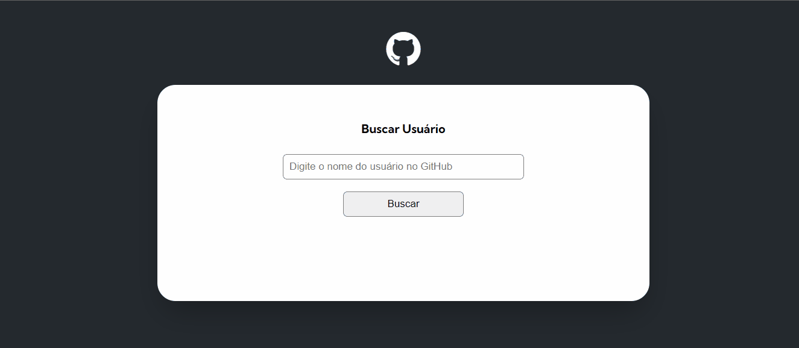

# Nome do projeto

"Projeto mundo real com Fetch e GitHub"

[Instagram]()

# Descrição

Projeto feito como atividade de treinamento para o curos DEV Quest, como uma quest final do módulo de JavaScript avançado.

# Desafio

Simular solicitações feitas por um suposto gerente de projeto a serem acrescentadas.

1º Trazer as seguintes informações formatadas:

* Imagem do usuário.

*  Nome completo do usário.

*  Login do usuário.

*  Bio.

2º Trazer também

* Número de seguidores do usuário.

*  Número de pessoas que o usuário está seguindo.

3º Apresentar uma lista:

* Contendo os 10 últimos eventos do usuário no GitHub.

* Cada atividade deve mostrar o nome do repositório e a mensagem do evento.

4º Além de trazer:

Nome do repositório e link.

* Quantidade de forks do repositório.

* Quantidade de estrelas do repositório.

* Quantidade de watchers do repositório.

* Mostrar a linguagem de programação do repositório.

# Conclusão 

Foi um grande desafio realizar este projeto seguindo as instruções pois é o meu primeiro projeto de JS avançado. Porém seguindo todas as dicas e com árduo estudo todos os dias fui capaz de desenvolver o código com exito aguardando a correção da equipe do curso.

# projeto-inicial-fetch-github-api

